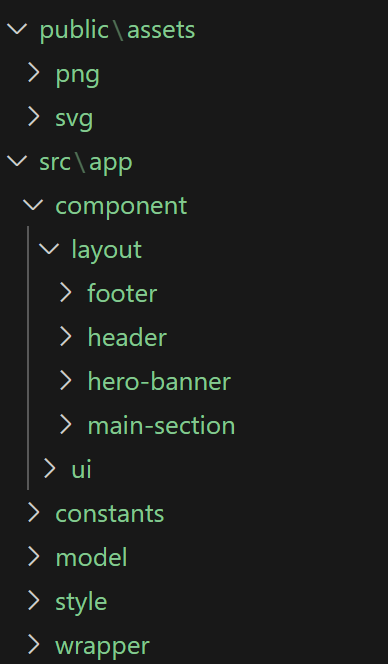

# Getting Started

First, you need to pull the repository from Github and run on local.

## Running on Local

1.	Clone the repository using Git or Github Desktop.
2.	Once cloned, open the repository in VS Code.
3.	Open the VS Code terminal. Make sure the path is set to the repository folder.
4.	Run ‘npm install’ to install any dependencies.
5.	Run ‘npm run dev’ to run the app. Open Chrome and navigate to the url ‘http://localhost:3000/’. The page should load and display the UI

# Technical Description

The project uses React and Next.js and was created using the command. 
‘npx create-next-app@latest’.

By default, the project uses Typescript, ESLint, Tailwind CSS. 

## Sass
'Sass' was installed using 'npm i sass'.

## Folder Structure
The ‘page.tsx’ and ‘layout.tsx’ are placed in the src folder.
Rest of the code is placed in the ‘app’ folder. 
The following image shows the structure of the folder for the project.

### Component
All components used in the project are placed inside this folder.

The 'component' folder is further divided into sub-folders: Layout & UI.

#### Layout
The folder stores all the components used in the page.

#### UI
The folder stores all the common component that are used in multiple places

### Constants
Holds all the data used in the project.

### Model
Interfaces used in the application are placed here.

### Style
Stylesheets(*.scss) used in the application.

### Wrapper
The application uses only one page, and the wrapper component is used to manage the state of the application.

